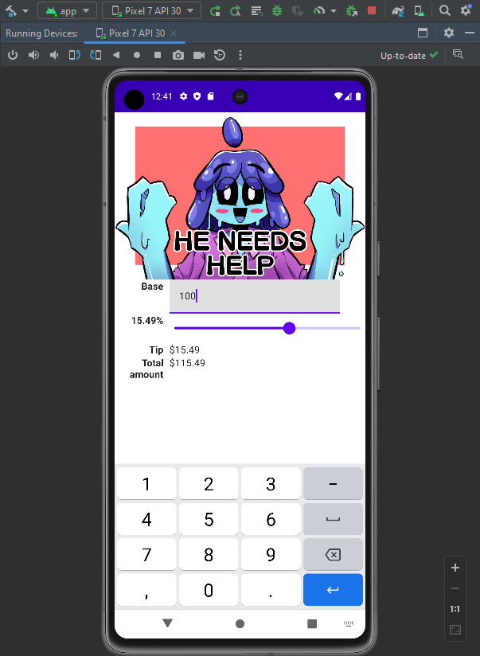

# tippy-jetpack-compose-android

By Hevanafa, 27th May 2023

Based on the tutorial from [freeCodeCamp.org - Android App Development Tutorial for Beginners - Your First App](https://www.youtube.com/watch?v=FjrKMcnKahY) but written in **Kotlin** &amp; **Jetpack Compose** with some differences such as the picture and the layout.

This app is basically a tip calculator with the base amount of money, the tip percentage and how much the total cost is.

The character in the picture is **Vivid**, made by **Aziru** my friend on FB.

## Preview

## Preparation

This project requires Android Studio Canary build (get it [here](https://developer.android.com/studio/preview)).  I doubt the other versions would work.

Everything is the default from **Empty Activity** provided by Android Studio (Canary build).

## Building the APK

Use Android Studio's Build APK menu.

I had to update some of the deps to follow the template from Canary build (Material3) due to the build process constantly being interrupted by **:app:checkDebugDuplicateClasses**.
